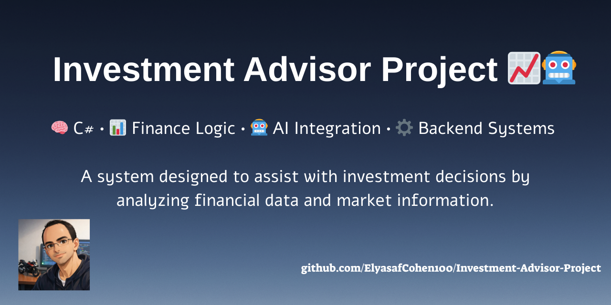

<p align="center">
  
</p>

# Investment Advisor Project 💼📈🧠 


> **Course Project | Windows Systems Engineering**  
> An AI-powered stock portfolio management system with real-time market data

---

## 🏷️ Technologies & Tools 

### Frontend


### Backend


### Cloud & AI Integrations


---

## ✨ Overview ✨

This project is a **Stock Portfolio Management System** 
developed as part of the **Windows Systems Engineering** course 💻🏗️  

It combines a modern **Python GUI (PySide6)** frontend with a powerful  
**ASP.NET Core** backend, alongside smart integrations with **cloud services** and an **AI-based investment advisor** 🤖☁️  

The system allows users to manage stock portfolios, visualize performance, and receive intelligent insights powered by an LLM. 🔮🫟

---

## 🎮 How to Use 🎮

- 🔐 Log in securely as a user  
- 📈 Buy or sell stocks through the GUI  
- 📊 View portfolio data in graph or table mode  
- 🧠 Ask the built-in AI advisor (powered by Ollama LLM) for financial recommendations  
- 🖼️ Upload supporting files (e.g., charts) via Cloudinary  
- 🌍 Retrieve real-time market data from Polygon.io  

---

## 📁 Project Structure 📁

### 🔙 Backend (`backend/`) 🔙
- `Controllers/` – REST API endpoints  
- `Services/` – business logic and domain services  
- `Repositories/` – data access layer  
- `DTOs/`, `Requests/`, `Models/` – structured data contracts  
- `appsettings.json` – environment and service configuration  
- `StockAdvisorBackend.sln` – Visual Studio solution  

### 🖥️ Frontend (`frontend/`) 🖥️
- `Windows/` – application GUI windows  
- `Services/` – API communication and helpers  
- `Constants/` – static values and configuration  
- `Pictures/` – icons, logos, and UI assets  
- `mainWindow.py` – application entry point  

---

## 🛠️ How to Run 🛠️

### Backend (API) 🪴

```bash
# Open in Visual Studio
StockAdvisorBackend.sln

# Configure appsettings.json
# Run using F5 or IIS Express
```

### Frontend (GUI App) 🪴

```bash
# Navigate to the frontend directory
cd frontend

# Install required dependencies
pip install PySide6

# Run the application
python Windows/mainWindow.py
```
---

## 🧑‍💻 Created By: 🧑‍💻

- Elyasaf Cohen 🦉
- Eldad Cohen   🦜
- Israel Shlomo 🦆


[](https://github.com/IsraelSh)
[](https://github.com/EldadCohen98)  
[](https://github.com/ElyasafCohen100)  

---

> ✨ If you like this project – please leave a star! ✨


